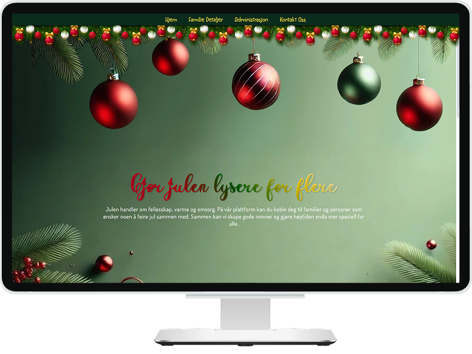

# Project name: HjerteJul

#### Group Project

### Project Goal:

I denne oppgaven skal dere lage en side som kobler brukeren til vanskeligstilte familier som ønsker noen å feire jul sammen med.

Siden skal kunne matche brukeren med familier basert på et fastsatt sett med egenskaper, som for eksempel størrelse på hus, antall mennesker man ønsker å feire med, allergier, matpreferanser eller andre ting. Man skal ha en oversikt over minst 20 familier, som har følgende info registrert:

- Et bilde
- Et navn
- En tittel
- En kort beskrivelse (Litt om oss, ca 50 ord)
- Ønsker/ Preferanser (Egenskaper) Man bør ha +/- 10 egenskaper å sortere etter

Siden skal ha et **søkefelt** hvor man kan søke etter keywords hos de ulike familiene, samt **sjekkbokser** hvor man kan sortere bort familier basert på faktorer man ikke kan tilpasse (for eksempel dyreallergi hos en som har kjæledyr). Når man klikker på en familie, skal man også få opp et **tekstfelt** hvor man kan booke en julefeiring med denne familien. Denne innsendingen trenger ikke å sendes noe sted, men det er en fordel om tekstfeltet tømmes.

Man skal også ha en side hvor man kan **opprette** nye familier, **redigere** de eksisterende familiene eller **slette** familier som ligger registrert inne. (`CRUD`)

Det skal også lages en **backend**, som skal servere dataen til til frontsiden.
Her kan dere bruke `JSON` for å lagre familiedata.

Da må det lages en model av jsonfilen, både i helhet, og hvert objekt, slik at applikasjonen kan lage, lese, lagre og slette data via modellen (CRUD).

Dataen må kunne lastes inn i minnet, og kunne lagres tilbake som JSON når det er gjort endringer, slik at applikasjonen kan ha en fast kilde til data mellom oppstarter.

Endepunktene til backenden skal støtte standard CRUD operasjonene frontend delen krever.

Man skal bruke `HTML`, `CSS`, `Javascript` og gjerne `JSON` til oppgaven.

## 💎 Description

"HjerteJul" is a group project developed with JavaScript and C# that connects users to families based on house size, food preferences, and allergies. It features CRUD functionality for managing families and a search tool for filtering results. Data is stored in JSON format, and the backend API supports standard CRUD operations.

### 🧩 Tech Stack

<!-- end:tech-stack -->

### ✨ Design:

### [Excalidraw](https://excalidraw.com/#json=MeUynUAkHuvZ8UY_7l9k2,pxLFEeXIYKJaiEv8RDvJxQ) | [Figma](https://www.figma.com/design/JQUoWwboyuKyu7vX0wS5Bd/HjerteJul?node-id=0-1&p=f&t=Jvo5dpt973x4ygY3-0) | [Demo](https://inna-b10.github.io/HjerteJul/)

### 🎓 Contributors:

- [Inna](https://github.com/Inna-B10)
- [Alissa-Ruya](https://github.com/Alissa-Ruya)
- [banjohans](https://github.com/banjohans)

 

---

### 📋 TODO:

- [ ] upload image option
- [ ] auto-rename image file (if upload): id_familyName
- [ ] check image format/size (jpg,png...)
- [ ] pop-up messages to user (instead alerts)
- [ ] refactoring form on index.html (use constants)
- [ ] more error checking on server side and send clear message to client side

<h4 style="display:inline; padding-left:6px;">✅ Done</h4>

- [x] return NoContent() change to response,response.status, response.statusText
- [x] [FIXME] select in renderForm()
- [x] redirect after deleting
- [x] design
- [x] text
- [x] clean up code, DRY!

